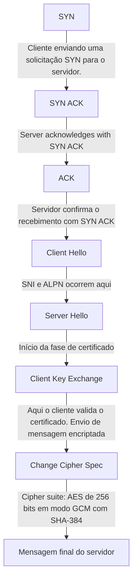

# Handshake

## Processo de handshake do TLS

---
## Analisando o fluxo da resposta do comando curl -svo /dev/null https://jamieede.com

	-s: modo "silent" (silencioso). Suprime o progresso e mensagens de erro.
	
	-v: modo "verbose". Mostra detalhes da comunicação com o servidor, como cabeçalhos de requisição e resposta.
	
	-o /dev/null: redireciona o corpo da resposta para o "buraco negro" do sistema, ou seja, descarta o conteúdo da página.
		
	Em suma, ele realiza uma requisição HTTP para https://jamieede.com, descarta o conteúdo da resposta, mas exibe os cabeçalhos e detalhes da conexão (por causa do -v).  O -s evita que o progresso da transferência seja exibido, deixando a saída mais limpa.

1. Resolução de DNS e conexão
* Host jamieede.com:443 was resolved.
* IPv4: 172.66.40.156, 172.66.43.100
* Trying 172.66.40.156:443...
O curl resolve o nome do domínio para dois endereços IP e tenta se conectar ao primeiro.
						
2. Negociação de protocolo via ALPN
* ALPN: curl offers h2,http/1.1
O cliente informa ao servidor que suporta os protocolos HTTP/2 (h2) e HTTP/1.1. 
O ALPN (Application-Layer Protocol Negotiation) permite que o servidor escolha qual protocolo será usado.
						
3. Início do handshake TLS 1.3
* TLSv1.3 (OUT), TLS handshake, Client hello (1):
O cliente envia um "Client Hello", que inclui:
						
Versões TLS suportadas
Cipher suites disponíveis
Extensões como SNI e ALPN
Chave pública efêmera para troca de chaves
						
4. Resposta do servidor
* TLSv1.3 (IN), TLS handshake, Server hello (2):
O servidor responde com:
						
Versão TLS escolhida
Cipher suite selecionada
Chave pública efêmera
Confirmação do protocolo via ALPN
					 
5. Envio do certificado
* TLSv1.3 (IN), TLS handshake, Certificate (11):
O servidor envia seu certificado digital, contendo:
						
	Nome do domínio (CN)
	Período de validade
	Autoridade certificadora (CA)
	Chave pública
					 
6. Verificação e finalização
* TLSv1.3 (IN), TLS handshake, CERT verify (15):
* TLSv1.3 (IN), TLS handshake, Finished (20):
* TLSv1.3 (OUT), TLS handshake, Finished (20):
Ambos os lados trocam mensagens "Finished" para confirmar que a troca de chaves e a autenticação foram bem-sucedidas.
						
7. Conexão segura estabelecida
* SSL connection using TLSv1.3 / TLS_AES_256_GCM_SHA384
A conexão agora está criptografada com:
						
	TLS 1.3
	Cipher suite: AES de 256 bits em modo GCM com SHA-384
					 
8. Certificado validado
* Server certificate:
* subject: CN=jamieede.com
* issuer: C=US; O=Google Trust Services; CN=WE1
*  SSL certificate verify ok.
  	O certificado é válido, emitido por uma autoridade confiável e corresponde ao domínio acessado.

9. Protocolo HTTP/2 ativado
* ALPN: server accepted h2
* using HTTP/2
	O servidor aceitou usar HTTP/2, que é mais eficiente que HTTP/1.1.

