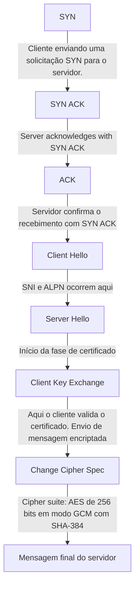

# Handshake

## Processo de handshake do TLS

## Analisando a resposta do comando curl -svo /dev/null https://jamieede.com

-s: modo "silent" (silencioso). Suprime o progresso e mensagens de erro.
-v: modo "verbose". Mostra detalhes da comunicação com o servidor, como cabeçalhos de requisição e resposta.
-o /dev/null: redireciona o corpo da resposta para o "buraco negro" do sistema, ou seja, descarta o conteúdo da página.
		
Em suma, ele realiza uma requisição HTTP para https://jamieede.com, descarta o conteúdo da resposta, mas exibe os cabeçalhos e detalhes da conexão (por causa do -v).  O -s evita que o progresso da transferência seja exibido, deixando a saída mais limpa.

