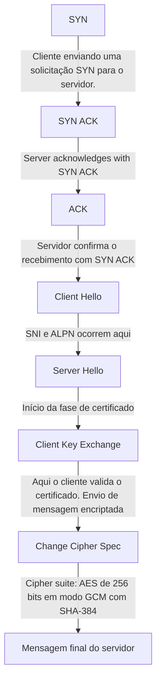

# Handshake

## Processo de handshake TCP com o endereço jamieede.com, após comando cURL (Wireshark):

	"No.","Time","Source","Destination","Protocol","Length","Info"
	"75","5.020590","192.168.100.40","192.168.100.1","DNS","72","Standard query 0x90f1 A jamieede.com"
	"76","5.052936","192.168.100.40","192.168.100.1","DNS","72","Standard query 0x90f1 A jamieede.com"
	"77","5.053789","192.168.100.1","192.168.100.40","DNS","104","Standard query response 0x90f1 A jamieede.com A 172.66.40.156 A 172.66.43.100"
	"78","5.055854","192.168.100.1","192.168.100.40","DNS","104","Standard query response 0x90f1 A jamieede.com A 172.66.43.100 A 172.66.40.156"
	"79","5.057728","192.168.100.40","172.66.40.156","TCP","66","56302  >  443 [SYN] Seq=0 Win=64240 Len=0 MSS=1460 WS=256 SACK_PERM"
	"80","5.078213","172.66.40.156","192.168.100.40","TCP","66","443  >  56302 [SYN, ACK] Seq=0 Ack=1 Win=65535 Len=0 MSS=1400 SACK_PERM WS=8192"
	"81","5.078254","192.168.100.40","172.66.40.156","TCP","54","56302  >  443 [ACK] Seq=1 Ack=1 Win=131584 Len=0"
	"82","5.079395","192.168.100.40","172.66.40.156","TLSv1.2","366","Client Hello (SNI=jamieede.com)"
	"83","5.100311","172.66.40.156","192.168.100.40","TCP","60","443  >  56302 [ACK] Seq=1 Ack=313 Win=131072 Len=0"
	"84","5.103434","172.66.40.156","192.168.100.40","TLSv1.2","1464","[TCP Previous segment not captured] , Ignored Unknown Record"
	"85","5.103453","192.168.100.40","172.66.40.156","TCP","66","[TCP Dup ACK 81#1] 56302  >  443 [ACK] Seq=313 Ack=1 Win=131584 Len=0 SLE=1413 SRE=2823"
	"86","5.103549","172.66.40.156","192.168.100.40","TCP","1466","[TCP Out-Of-Order] 443  >  56302 [ACK] Seq=1 Ack=313 Win=131072 Len=1412"
	"87","5.103571","192.168.100.40","172.66.40.156","TCP","54","56302  >  443 [ACK] Seq=313 Ack=2823 Win=131584 Len=0"
	"88","5.128564","192.168.100.40","172.66.40.156","TLSv1.2","60","Change Cipher Spec"
	"89","5.128609","192.168.100.40","172.66.40.156","TLSv1.2","128","Application Data"
	"90","5.148709","172.66.40.156","192.168.100.40","TCP","60","443  >  56302 [ACK] Seq=2823 Ack=393 Win=131072 Len=0"
	"91","5.148748","172.66.40.156","192.168.100.40","TLSv1.2","116","Application Data"
	"92","5.158716","192.168.100.40","172.66.40.156","TLSv1.2","178","Application Data"
	"93","5.162018","192.168.100.40","172.66.40.156","TLSv1.2","85","Application Data"
	"94","5.179018","172.66.40.156","192.168.100.40","TLSv1.2","85","Application Data"
	"95","5.197713","172.66.40.156","192.168.100.40","TLSv1.2","372","Application Data"
	"96","5.197729","192.168.100.40","172.66.40.156","TCP","54","56302  >  443 [ACK] Seq=548 Ack=3234 Win=131072 Len=0"
	"97","5.197836","172.66.40.156","192.168.100.40","TLSv1.2","1445","Application Data"
	"98","5.197954","172.66.40.156","192.168.100.40","TLSv1.2","1466","Application Data"
	"99","5.197963","192.168.100.40","172.66.40.156","TCP","54","56302  >  443 [ACK] Seq=548 Ack=6037 Win=131584 Len=0"
	"100","5.198070","172.66.40.156","192.168.100.40","TLSv1.2","1424","Application Data"
	"101","5.198188","172.66.40.156","192.168.100.40","TLSv1.2","1431","Application Data"
	"102","5.198188","172.66.40.156","192.168.100.40","TLSv1.2","85","Application Data"
	"103","5.198208","192.168.100.40","172.66.40.156","TCP","54","56302  >  443 [ACK] Seq=548 Ack=8815 Win=131584 Len=0"
	"104","5.215310","192.168.100.40","172.66.40.156","TLSv1.2","89","Application Data"
	"105","5.216656","192.168.100.40","172.66.40.156","TLSv1.2","102","Application Data"
	"106","5.216673","192.168.100.40","172.66.40.156","TLSv1.2","78","Application Data"
	"107","5.217798","192.168.100.40","172.66.40.156","TCP","54","56302  >  443 [FIN, ACK] Seq=655 Ack=8815 Win=131584 Len=0"
	"108","5.236222","172.66.40.156","192.168.100.40","TCP","60","443  >  56302 [ACK] Seq=8815 Ack=631 Win=131072 Len=0"
	"109","5.238189","172.66.40.156","192.168.100.40","TCP","60","443  >  56302 [FIN, ACK] Seq=8815 Ack=656 Win=131072 Len=0"
	"110","5.238200","192.168.100.40","172.66.40.156","TCP","54","56302  >  443 [ACK] Seq=656 Ack=8816 Win=131584 Len=0"

## Processo de handshake do TLS

---
## Analisando o comando curl -svo /dev/null https://jamieede.com

-s: modo "silent" (silencioso). Suprime o progresso e mensagens de erro.
	
-v: modo "verbose". Mostra detalhes da comunicação com o servidor, como cabeçalhos de requisição e resposta.
	
-o /dev/null: redireciona o corpo da resposta para o "buraco negro" do sistema, ou seja, descarta o conteúdo da página.
		
Em suma, ele realiza uma requisição HTTP para https://jamieede.com, descarta o conteúdo da resposta, mas exibe os cabeçalhos e detalhes da conexão (por causa do -v).  O -s evita que o progresso da transferência seja exibido, deixando a saída mais limpa.

### Analisando a resposta do comando: 

	* Host jamieede.com:443 was resolved.
	* IPv6: (none)
	* IPv4: 172.66.40.156, 172.66.43.100
	*   Trying 172.66.40.156:443...
	* ALPN: curl offers h2,http/1.1
	* TLSv1.3 (OUT), TLS handshake, Client hello (1):
	} [307 bytes data]
	*  CAfile: C:\curl\cacert.pem
	*  CApath: none
	* TLSv1.3 (IN), TLS handshake, Server hello (2):
	{ [122 bytes data]
	* TLSv1.3 (IN), TLS handshake, Unknown (8):
	{ [19 bytes data]
	* TLSv1.3 (IN), TLS handshake, Certificate (11):
	{ [2517 bytes data]
	* TLSv1.3 (IN), TLS handshake, CERT verify (15):
	{ [79 bytes data]
	* TLSv1.3 (IN), TLS handshake, Finished (20):
	{ [52 bytes data]
	* TLSv1.3 (OUT), TLS handshake, Finished (20):
	} [52 bytes data]
	* SSL connection using TLSv1.3 / TLS_AES_256_GCM_SHA384 / [blank] / UNDEF
	* ALPN: server accepted h2
	* Server certificate:
	*  subject: CN=jamieede.com
	*  start date: Jun  3 04:52:17 2025 GMT
	*  expire date: Sep  1 05:52:12 2025 GMT
	*  subjectAltName: host "jamieede.com" matched cert's "jamieede.com"
	*  issuer: C=US; O=Google Trust Services; CN=WE1
	*  SSL certificate verify ok.
	*   Certificate level 0: Public key type ? (256/128 Bits/secBits), signed using ecdsa-with-SHA256
	*   Certificate level 1: Public key type ? (256/128 Bits/secBits), signed using ecdsa-with-SHA384
	*   Certificate level 2: Public key type ? (384/192 Bits/secBits), signed using ecdsa-with-SHA384
	* Connected to jamieede.com (172.66.40.156) port 443
	* using HTTP/2
	* [HTTP/2] [1] OPENED stream for https://jamieede.com/
	* [HTTP/2] [1] [:method: GET]
	* [HTTP/2] [1] [:scheme: https]
	* [HTTP/2] [1] [:authority: jamieede.com]
	* [HTTP/2] [1] [:path: /]
	* [HTTP/2] [1] [user-agent: curl/8.14.1]
	* [HTTP/2] [1] [accept: */*]
	> GET / HTTP/2
	> Host: jamieede.com
	> User-Agent: curl/8.14.1
	> Accept: */*
	>
	* Request completely sent off
	< HTTP/2 403
	< date: Thu, 03 Jul 2025 20:16:54 GMT
	< content-type: text/html; charset=UTF-8
	< x-frame-options: SAMEORIGIN
	< referrer-policy: same-origin
	< cache-control: private, max-age=0, no-store, no-cache, must-revalidate, post-check=0, pre-check=0
	< expires: Thu, 01 Jan 1970 00:00:01 GMT
	< strict-transport-security: max-age=15552000; includeSubDomains
	< x-content-type-options: nosniff
	< server: cloudflare
	< cf-ray: 959910320c5901a9-GRU
	< alt-svc: h3=":443"; ma=86400
	<
	{ [1360 bytes data]
	* client returned ERROR on write of 1360 bytes
	* Connection #0 to host jamieede.com left intact

### Resolução de DNS e conexão

   	Host jamieede.com:443 was resolved.
	IPv4: 172.66.40.156, 172.66.43.100
	Trying 172.66.40.156:443...

O curl resolve o nome do domínio para dois endereços IP e tenta se conectar ao primeiro.
						
### Negociação de protocolo via ALPN

	ALPN: curl offers h2,http/1.1
 
O cliente informa ao servidor que suporta os protocolos HTTP/2 (h2) e HTTP/1.1. 
O ALPN (Application-Layer Protocol Negotiation) permite que o servidor escolha qual protocolo será usado.
						
### Início do handshake TLS 1.3
	
 	TLSv1.3 (OUT), TLS handshake, Client hello (1)

O cliente envia um "Client Hello", que inclui:
						
Versões TLS suportadas
Cipher suites disponíveis
Extensões como SNI e ALPN
Chave pública efêmera para troca de chaves
						
### Resposta do servidor
	TLSv1.3 (IN), TLS handshake, Server hello (2):

O servidor responde com:	

Versão TLS escolhida

Cipher suite selecionada

Chave pública efêmera

Confirmação do protocolo via ALPN
					 
### Envio do certificado

	TLSv1.3 (IN), TLS handshake, Certificate (11):
 
O servidor envia seu certificado digital, contendo:
						
Nome do domínio (CN)
Período de validade
Autoridade certificadora (CA)
Chave pública
					 
### Verificação e finalização

	TLSv1.3 (IN), TLS handshake, CERT verify (15):
	TLSv1.3 (IN), TLS handshake, Finished (20):
	TLSv1.3 (OUT), TLS handshake, Finished (20):
 
Ambos os lados trocam mensagens "Finished" para confirmar que a troca de chaves e a autenticação foram bem-sucedidas.
						
### Conexão segura estabelecida

	SSL connection using TLSv1.3 / TLS_AES_256_GCM_SHA384
 
A conexão agora está criptografada com:				

TLS 1.3
	
Cipher suite: AES de 256 bits em modo GCM com SHA-384
					 
### Certificado validado

	Server certificate:
	subject: CN=jamieede.com
 	issuer: C=US; O=Google Trust Services; CN=WE1
  	SSL certificate verify ok.
  	
O certificado é válido, emitido por uma autoridade confiável e corresponde ao domínio acessado.

### Protocolo HTTP/2 ativado

	ALPN: server accepted h2
	using HTTP/2
 
O servidor aceitou usar HTTP/2, que é mais eficiente que HTTP/1.1.

---
# Extensões TLS: 

## Client Hello 

O Client Hello é a primeira mensagem enviada por um cliente (como um navegador ou aplicativo) durante o processo de handshake TLS (Transport Layer Security) — o protocolo que garante a comunicação segura entre dois sistemas, como seu computador e um site.

Aqui está um resumo do que acontece nessa etapa:

🔐 O que é o Client Hello?
É uma mensagem enviada pelo cliente para iniciar uma conexão segura. Ela contém:

Versão do protocolo TLS que o cliente suporta.
Lista de algoritmos de criptografia (cipher suites) que o cliente pode usar.
Dados aleatórios (random bytes) usados para gerar chaves seguras.
Extensões TLS, como o SNI (Server Name Indication), que informa ao servidor qual domínio o cliente quer acessar (útil em servidores com múltiplos domínios).
Session ID (opcional), se o cliente quiser retomar uma sessão anterior.

📦 O que vai no ClientHello?
Versão máxima do TLS suportada
Número aleatório (Client Random)
Usado na geração da chave de sessão.
Lista de cipher suites suportadas
Ex: TLS_AES_256_GCM_SHA384, TLS_CHACHA20_POLY1305_SHA256, etc.
O cliente envia várias opções, em ordem de preferência.
Métodos de compressão (hoje em dia quase sempre "null")
Extensões TLS, como:
SNI (Server Name Indication)
ALPN (Application-Layer Protocol Negotiation)
Session ID / Session Ticket
E outras

### Session IDs 

In computer science, a session identifier, session ID or session token is a piece of data that is used in network communications (often over HTTP) to identify a session, a series of related message exchanges. 
Session identifiers become necessary in cases where the communications infrastructure uses a stateless protocol such as HTTP. 
	
#### Explicando Session IDs:
Um Session ID (ou identificador de sessão) é um código único que um servidor gera e atribui a um cliente (como um navegador) para identificar uma sessão específica de comunicação.
O protocolo HTTP, usado na web, é stateless — ou seja, não guarda memória entre uma requisição e outra. Cada vez que você acessa uma página, o servidor não sabe automaticamente quem você é ou o que você fez antes.
É aí que entra o Session ID: ele cria uma “memória” temporária entre cliente e servidor.
	
1.Você acessa um site (ex: faz login).
2.O servidor gera um Session ID único (ex: abc123xyz) e o envia para o navegador.
3.Esse ID é armazenado no navegador (geralmente em um cookie).
4.Em cada nova requisição, o navegador envia esse ID de volta.
5.O servidor usa esse ID para recuperar os dados da sua sessão (como seu nome, carrinho de compras, preferências etc.).
	
🧪 Exemplo prático
Imagine que você entra em um site de compras:

Você adiciona um item ao carrinho.
O servidor associa esse item ao seu Session ID.
Mesmo que você vá para outra página, o servidor sabe que aquele carrinho é seu, porque o Session ID continua sendo enviado.
	
Session IDs devem ser:

Aleatórios e difíceis de adivinhar (para evitar sequestro de sessão).
Transmitidos com segurança (via HTTPS).
Expirados após um tempo de inatividade.

### Session Tickets

Instead of session IDs. Session Tickets define a way to resume a TLS session without requiring that the session-specific state is stored at the TLS server.
When using session tickets, the TLS server stores its session-specific state in a session ticket and sends the session ticket to the TLS client for storing. 
The client resumes a TLS session by sending the session ticket to the server, and the server resumes the TLS session according to the session-specific state in the ticket. 
The session ticket is encrypted and authenticated by the server, and the server verifies its validity before using its contents.
	
#### Explicando Session Tickets: 

Session Tickets são uma forma de retomar uma sessão TLS anterior sem que o servidor precise guardar informações da sessão anterior em sua memória.
	
Como funciona o Session Tickets: 
Cliente inicia uma conexão TLS.
Servidor gera um Session Ticket, contendo os dados da sessão (como chaves e parâmetros).
O ticket é criptografado e autenticado pelo servidor.
O cliente armazena o ticket (geralmente em memória).
Em uma nova conexão, o cliente envia o ticket de volta ao servidor.
O servidor valida e descriptografa o ticket, e retoma a sessão com base nas informações contidas nele.
	
Segurança:
O ticket é criptografado com uma chave secreta do servidor.
O cliente não consegue ler nem modificar o conteúdo do ticket.
O servidor verifica a validade do ticket antes de usá-lo.
	
Eficiência: evita novo handshake completo.
Escalabilidade: o servidor não precisa manter estado para cada cliente.
Rapidez: retomada de sessão é mais rápida e consome menos recursos.

### Server Name Indicator (SNI)

Server Name Indication (SNI) is an extension to the Transport Layer Security (TLS) computer networking protocol by which a client indicates which hostname it is attempting to connect to at the start of the handshaking process. 
This allows a server to present one of multiple possible certificates on the same IP address and TCP port number and hence allows multiple secure (HTTPS) websites (or any other service over TLS) to be served by the same 
IP address without requiring all those sites to use the same certificate.
	
#### Explicando o SNI:
Server Name Indication é uma extensão do protocolo TLS que permite ao cliente informar ao servidor o nome do host (domínio) que ele quer acessar logo no início do handshake TLS.
Antes do SNI, quando um servidor recebia uma conexão TLS, ele não sabia qual certificado apresentar, porque o nome do site (como exemplo.com) só era revelado depois do handshake — mas o certificado precisa ser apresentado durante o handshake.

Isso era um problema quando:
Vários sites HTTPS estavam hospedados no mesmo IP e porta.
Cada site precisava de um certificado diferente.
	
Com o SNI:

O cliente envia o nome do host (ex: exemplo.com) logo no início do handshake.
O servidor usa esse nome para escolher o certificado correto.
A conexão TLS continua normalmente, com o certificado adequado.
	
🧪 Exemplo prático
Imagine que você tem dois sites: site1.com e site2.com
Ambos estão no mesmo servidor e IP, mas têm certificados diferentes.

Sem SNI: o servidor não sabe qual certificado usar → erro de certificado.

Com SNI: o cliente diz “quero site2.com” → o servidor apresenta o certificado de site2.com → tudo funciona.
	
O SNI não é criptografado no TLS 1.2, o que significa que terceiros podem ver qual site você está acessando.
No TLS 1.3 com ESNI (Encrypted SNI), essa informação pode ser protegida — mas ainda não é amplamente adotado.

### Application Layer Protocol Negotiation (ALPN)

Application-Layer Protocol Negotiation (ALPN) is a Transport Layer Security (TLS) extension that allows the application layer (Layer 4) to negotiate which protocol should be performed over a secure connection in a manner that avoids additional round trips and which is independent of the application-layer protocols.

#### Explicando o ALPN:

ALPN é uma extensão do protocolo TLS que permite que o cliente e o servidor escolham qual protocolo de aplicação usar (como HTTP/1.1 ou HTTP/2) durante o handshake TLS, ou seja, antes da conexão segura ser estabelecida.
	
🧩 Por que isso é útil?
Sem ALPN, o cliente e o servidor precisariam:

Estabelecer a conexão TLS primeiro.
Depois, negociar o protocolo de aplicação (como HTTP ou SPDY).
Isso exigiria mais uma troca de mensagens (round trip), o que aumenta a latência.

Com ALPN:

O cliente já informa quais protocolos suporta durante o handshake TLS.
O servidor escolhe um deles e responde.
A negociação é feita sem custo adicional de tempo.
	
🔄 Como funciona o ALPN?
	
O cliente inicia o handshake TLS e envia uma lista de protocolos que suporta (ex: ["h2", "http/1.1"]).
O servidor escolhe um protocolo da lista (ex: h2 para HTTP/2).
O protocolo escolhido é usado imediatamente após o handshake.
	
🧪 Exemplo prático
Você acessa um site moderno com curl ou navegador:

O cliente oferece: h2, http/1.1
O servidor responde: h2
A conexão segura é estabelecida e o tráfego segue via HTTP/2
	
✅ Benefícios do ALPN
Reduz latência: evita round trips extras.
Melhora desempenho: especialmente em conexões HTTPS.
Suporta múltiplos protocolos: como HTTP/2, HTTP/3, gRPC, etc.
Independente do protocolo de aplicação: funciona com qualquer protocolo sobre TLS.

## O que aparece e não aparece no hanshake TLS de um comando cURL: 

### Client Hello (Início da conexão TLS)

| Campo                                           | Visível?         | Observação                                                                 |
|------------------------------------------------|------------------|----------------------------------------------------------------------------|
| Versão máxima do TLS suportada                 | ✅ Sim           | TLSv1.3 (OUT), handshake mostra que o cliente está usando TLS 1.3.         |
| Número aleatório                               | ❌ Não           | Não é exibido diretamente na saída do `curl -v`.                           |
| Lista de cipher suites                         | ❌ Não           | Não aparece na saída padrão do curl, mas é enviada no ClientHello.        |
| Métodos de compressão                          | ❌ Não           | Está no ClientHello, mas não é mostrado na saída.                          |
| Session ID                                     | ❌ Não visível   | Pode estar presente, mas não é mostrado explicitamente.                    |
| Session Ticket                                 | ❌ Não visível   | Pode ser usado, mas não aparece na saída.                                  |
| SNI (Server Name Indication)                   | ✅ Sim (inferido)| Certificado retornado indica que o SNI foi enviado corretamente.           |
| ALPN (Application-Layer Protocol Negotiation)  | ✅ Sim           | `curl` mostra ALPN: `h2`, `http/1.1` e o servidor aceitando `h2`.          |

🔄 O que acontece depois?
O servidor responde com um Server Hello, escolhendo os parâmetros de segurança.
O servidor envia seu certificado digital.
Ambos os lados trocam chaves e finalizam o handshake.
A comunicação segura começa.

---

## Server Hello
	
After receiving the client hello, the server picks the parameters for the handshake going forward. The server then responds by choosing the following from the Client Hello: a protocol version, a random number, 
a cipher suite, and a compression method. The server may enforce its own preference of cipher suite selection. The server sends the above choices, as well as its certificate to the client, followed by a message 
that it is finished with the handshake negotiation.
	
	
🔄 O servidor
Escolhe a cipher suite que também suporta.
Usa o Client Random + Server Random para gerar a chave de sessão.
Responde com um ServerHello contendo:
	
 	1. A cipher suite escolhida
 
	2. Seu próprio número aleatório
	
 	3. Seu certificado digital

	4. outras informações

### 🧩 Componentes de uma Cipher Suite
 
Uma cipher suite geralmente inclui quatro partes principais:
Algoritmo de troca de chaves

Ex: ECDHE, RSA
Define como cliente e servidor trocam chaves de forma segura.
Algoritmo de autenticação

Ex: RSA, ECDSA
Verifica a identidade do servidor (e opcionalmente do cliente).
Algoritmo de criptografia simétrica

Ex: AES_256_GCM, ChaCha20
Criptografa os dados transmitidos após o handshake.
Algoritmo de integridade (MAC)

Ex: SHA256, SHA384
Garante que os dados não foram alterados.

## Client Key Exchange
	
Validação do Certificado
O cliente verifica se o certificado do servidor:
		
  É confiável (está na trust store)
  Está dentro do período de validade
  Não foi revogado pela autoridade certificadora (CA)

O cliente envia um segredo (ou parâmetros para derivá-lo) que será usado para gerar a chave de sessão. Em TLS 1.3, isso é feito com chaves efêmeras (ECDHE), e essa etapa pode estar embutida no ClientHello.
	
Finished (Cliente)
O cliente envia uma mensagem criptografada com um código de autenticação (MAC) para confirmar que o handshake foi bem-sucedido do seu lado.
	
Finished (Servidor)
O servidor envia sua própria mensagem Finished, confirmando que tudo está certo do lado dele.
	
	1. Client Hello
	2. Server Hello
	3. Client Key Exchange
	4. Change Cipher Spec

