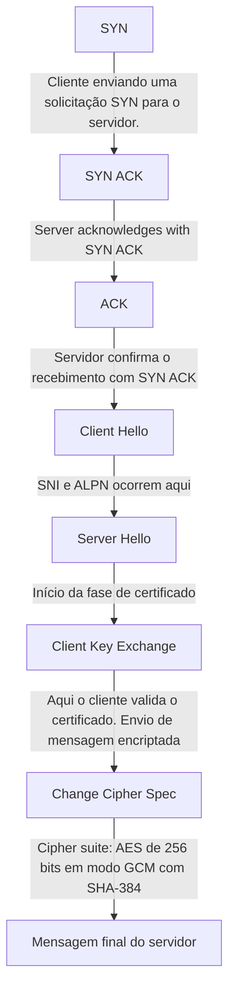

# Handshake

## Processo de handshake do TLS

---
## Analisando o comando curl -svo /dev/null https://jamieede.com

-s: modo "silent" (silencioso). Suprime o progresso e mensagens de erro.
	
-v: modo "verbose". Mostra detalhes da comunicação com o servidor, como cabeçalhos de requisição e resposta.
	
-o /dev/null: redireciona o corpo da resposta para o "buraco negro" do sistema, ou seja, descarta o conteúdo da página.
		
Em suma, ele realiza uma requisição HTTP para https://jamieede.com, descarta o conteúdo da resposta, mas exibe os cabeçalhos e detalhes da conexão (por causa do -v).  O -s evita que o progresso da transferência seja exibido, deixando a saída mais limpa.

### Analisando a resposta do comando: 

	* Host jamieede.com:443 was resolved.
	* IPv6: (none)
	* IPv4: 172.66.40.156, 172.66.43.100
	*   Trying 172.66.40.156:443...
	* ALPN: curl offers h2,http/1.1
	* TLSv1.3 (OUT), TLS handshake, Client hello (1):
	} [307 bytes data]
	*  CAfile: C:\curl\cacert.pem
	*  CApath: none
	* TLSv1.3 (IN), TLS handshake, Server hello (2):
	{ [122 bytes data]
	* TLSv1.3 (IN), TLS handshake, Unknown (8):
	{ [19 bytes data]
	* TLSv1.3 (IN), TLS handshake, Certificate (11):
	{ [2517 bytes data]
	* TLSv1.3 (IN), TLS handshake, CERT verify (15):
	{ [79 bytes data]
	* TLSv1.3 (IN), TLS handshake, Finished (20):
	{ [52 bytes data]
	* TLSv1.3 (OUT), TLS handshake, Finished (20):
	} [52 bytes data]
	* SSL connection using TLSv1.3 / TLS_AES_256_GCM_SHA384 / [blank] / UNDEF
	* ALPN: server accepted h2
	* Server certificate:
	*  subject: CN=jamieede.com
	*  start date: Jun  3 04:52:17 2025 GMT
	*  expire date: Sep  1 05:52:12 2025 GMT
	*  subjectAltName: host "jamieede.com" matched cert's "jamieede.com"
	*  issuer: C=US; O=Google Trust Services; CN=WE1
	*  SSL certificate verify ok.
	*   Certificate level 0: Public key type ? (256/128 Bits/secBits), signed using ecdsa-with-SHA256
	*   Certificate level 1: Public key type ? (256/128 Bits/secBits), signed using ecdsa-with-SHA384
	*   Certificate level 2: Public key type ? (384/192 Bits/secBits), signed using ecdsa-with-SHA384
	* Connected to jamieede.com (172.66.40.156) port 443
	* using HTTP/2
	* [HTTP/2] [1] OPENED stream for https://jamieede.com/
	* [HTTP/2] [1] [:method: GET]
	* [HTTP/2] [1] [:scheme: https]
	* [HTTP/2] [1] [:authority: jamieede.com]
	* [HTTP/2] [1] [:path: /]
	* [HTTP/2] [1] [user-agent: curl/8.14.1]
	* [HTTP/2] [1] [accept: */*]
	> GET / HTTP/2
	> Host: jamieede.com
	> User-Agent: curl/8.14.1
	> Accept: */*
	>
	* Request completely sent off
	< HTTP/2 403
	< date: Thu, 03 Jul 2025 20:16:54 GMT
	< content-type: text/html; charset=UTF-8
	< x-frame-options: SAMEORIGIN
	< referrer-policy: same-origin
	< cache-control: private, max-age=0, no-store, no-cache, must-revalidate, post-check=0, pre-check=0
	< expires: Thu, 01 Jan 1970 00:00:01 GMT
	< strict-transport-security: max-age=15552000; includeSubDomains
	< x-content-type-options: nosniff
	< server: cloudflare
	< cf-ray: 959910320c5901a9-GRU
	< alt-svc: h3=":443"; ma=86400
	<
	{ [1360 bytes data]
	* client returned ERROR on write of 1360 bytes
	* Connection #0 to host jamieede.com left intact

### Resolução de DNS e conexão

   	Host jamieede.com:443 was resolved.
	IPv4: 172.66.40.156, 172.66.43.100
	Trying 172.66.40.156:443...

O curl resolve o nome do domínio para dois endereços IP e tenta se conectar ao primeiro.
						
### Negociação de protocolo via ALPN

	ALPN: curl offers h2,http/1.1
 
O cliente informa ao servidor que suporta os protocolos HTTP/2 (h2) e HTTP/1.1. 
O ALPN (Application-Layer Protocol Negotiation) permite que o servidor escolha qual protocolo será usado.
						
### Início do handshake TLS 1.3
	
 	TLSv1.3 (OUT), TLS handshake, Client hello (1)

O cliente envia um "Client Hello", que inclui:
						
Versões TLS suportadas
Cipher suites disponíveis
Extensões como SNI e ALPN
Chave pública efêmera para troca de chaves
						
### Resposta do servidor
	TLSv1.3 (IN), TLS handshake, Server hello (2):

O servidor responde com:	

Versão TLS escolhida

Cipher suite selecionada

Chave pública efêmera

Confirmação do protocolo via ALPN
					 
## Envio do certificado

	TLSv1.3 (IN), TLS handshake, Certificate (11):
 
O servidor envia seu certificado digital, contendo:
						
Nome do domínio (CN)
Período de validade
Autoridade certificadora (CA)
Chave pública
					 
## Verificação e finalização

	TLSv1.3 (IN), TLS handshake, CERT verify (15):
	TLSv1.3 (IN), TLS handshake, Finished (20):
	TLSv1.3 (OUT), TLS handshake, Finished (20):
 
Ambos os lados trocam mensagens "Finished" para confirmar que a troca de chaves e a autenticação foram bem-sucedidas.
						
## Conexão segura estabelecida

	SSL connection using TLSv1.3 / TLS_AES_256_GCM_SHA384
 
A conexão agora está criptografada com:				

TLS 1.3
	
Cipher suite: AES de 256 bits em modo GCM com SHA-384
					 
## Certificado validado

	Server certificate:
	subject: CN=jamieede.com
 	issuer: C=US; O=Google Trust Services; CN=WE1
  	SSL certificate verify ok.
  	
O certificado é válido, emitido por uma autoridade confiável e corresponde ao domínio acessado.

## Protocolo HTTP/2 ativado

	ALPN: server accepted h2
	using HTTP/2
 
O servidor aceitou usar HTTP/2, que é mais eficiente que HTTP/1.1.

---

